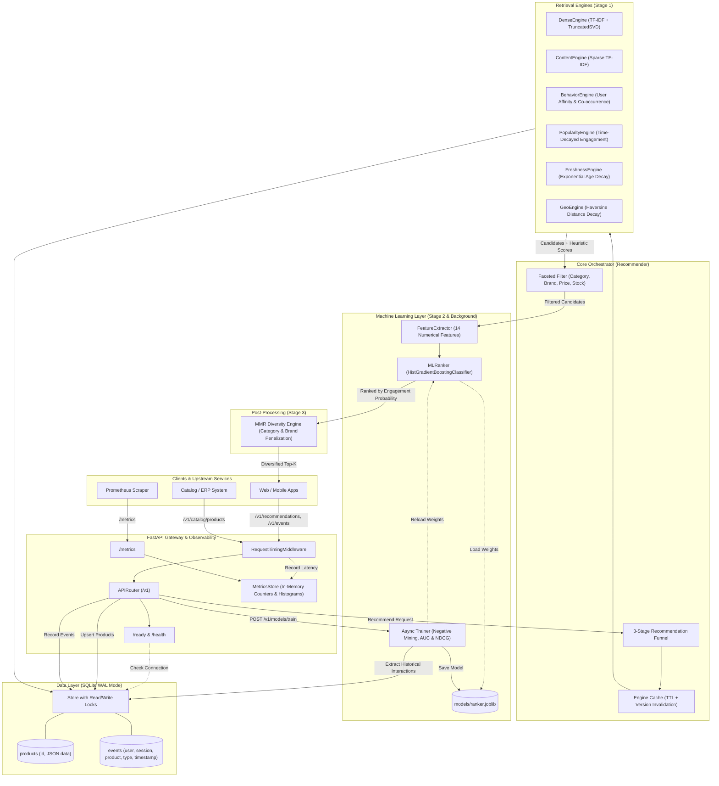
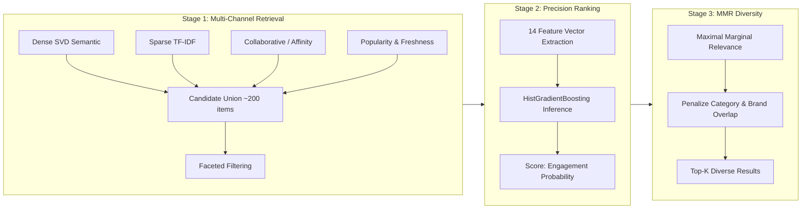

# Recommendation Engine V2 (Production-Grade)

Standalone, e-commerce-agnostic **Recommendation-as-a-Service** built with FastAPI, SQLite, Scikit-Learn, and Docker.

---

## What's New in V2

- **Dense Semantic Retrieval (LSA)** — TF-IDF + TruncatedSVD(128) dense projection pipeline capturing semantic similarity (e.g. "wireless earbuds" matching "Bluetooth headphones").
- **Self-Training ML Ranker** — `HistGradientBoostingClassifier` model trained directly on user interactions (purchases, carts, views) using 14 engineered features. Silently and gracefully falls back to heuristic blending if no model is trained yet.
- **MMR Diversity Re-Ranking** — Maximal Marginal Relevance pass avoiding repetitive results by penalizing category and brand duplication, controllable via `diversity_factor`.
- **Full Observability** — In-process Prometheus `/metrics` exporter (counters, latency histograms), Kubernetes-compatible `/ready` probe, request timing middleware, and structured JSON logs.
- **Containerized & Production Ready** — Zero new mandatory dependencies, multi-stage `Dockerfile`, and `docker-compose.yml` pre-configured with Prometheus.

---

## Core Features

- **Universal catalog ingestion** — Ingest any product schema via single or bulk REST endpoints
- **Event ingestion** — Track user actions (`product_view`, `product_click`, `add_to_cart`, `purchase`, `search`, etc.)
- **Anonymous & authenticated users** — Attribution via `user_id` or `anonymous_id`
- **Session-aware intent signals** — Dynamic boosts based on recent in-session searches and interactions
- **Dual-channel retrieval** — Sparse TF-IDF cosine similarity + Dense SVD semantic retrieval
- **Collaborative filtering** — Co-occurrence matrix across positive user interactions
- **Popular & trending ranking** — Exponential time-decayed engagement scoring (`math.exp(-age / 14)`)
- **Freshness boosting** — Exponential decay boost (`math.exp(-age / 7)`) for newly added catalog products
- **Optional geo-aware ranking** — Distance-decay scoring using user coordinates and product location metadata
- **Faceted filtering** — Filter recommendations by category, brand, price ranges (`min_price`, `max_price`), availability, and attributes
- **Engine caching & lifecycle** — In-memory caching with TTL and automatic invalidation on catalog updates
- **Zero-config SQLite with WAL** — Thread-safe concurrent reads with Write-Ahead Logging

---

## System Architecture



---

## 3-Stage Recommendation Funnel



---

## Project Structure

```
recommender_v1/
├── app/
│   ├── config.py           # Configurable settings (DB path, candidate limits, engine weights, TTL)
│   ├── main.py             # FastAPI entrypoint, lifespan, error handlers, observability endpoints
│   ├── core/
│   │   ├── recommender.py  # Orchestrator: candidate generation, ML ranker scoring, MMR diversity
│   │   └── metrics.py      # Thread-safe in-process Prometheus metrics store & text serializer
│   ├── engines/
│   │   ├── content.py      # Sparse TF-IDF content similarity & query search
│   │   ├── dense.py        # Dense LSA (TF-IDF + TruncatedSVD) semantic retrieval
│   │   ├── diversity.py    # Maximal Marginal Relevance (MMR) re-ranking
│   │   ├── behavior.py     # User affinity & collaborative co-occurrence
│   │   ├── popularity.py   # Time-decayed popularity ranking
│   │   ├── freshness.py    # Time-decayed catalog freshness ranking
│   │   └── geo.py          # Haversine distance-based geo scoring
│   ├── ml/
│   │   ├── features.py     # 14-feature extraction pipeline (user, product, cross, context)
│   │   ├── ranker.py       # MLRanker wrapper around HistGradientBoostingClassifier
│   │   └── trainer.py      # Negative sampling, 80/20 train/val split, AUC & NDCG evaluation
│   ├── models/
│   │   └── schemas.py      # Pydantic schemas (Product, Event, Request, Response)
│   └── storage/
│       └── store.py        # SQLite storage with WAL mode, indexing, thread safety
├── tests/
│   ├── test_basic.py       # Basic health check test
│   ├── test_recommender.py # V1 regression test suite (9 tests)
│   └── test_v2.py          # V2 production test suite (8 tests)
├── Dockerfile              # Production container build
├── docker-compose.yml      # Service orchestration (API + Prometheus)
├── prometheus.yml          # Prometheus scrape configuration
├── pytest.ini              # Pytest configuration
├── requirements.txt        # Production dependencies
└── requirements-dev.txt    # Development and testing dependencies
```

---

## API Endpoints

| Method | Path | Description |
|---|---|---|
| `GET` | `/health` | Service liveness probe |
| `GET` | `/ready` | Service readiness probe (validates database connectivity) |
| `GET` | `/metrics` | Prometheus metrics exposition (`recsys_requests_total`, `recsys_latency_ms`, etc.) |
| `POST` | `/v1/catalog/products` | Upsert a single product |
| `POST` | `/v1/catalog/products/bulk` | Bulk upsert a list of products |
| `POST` | `/v1/events` | Ingest user/session interaction events |
| `POST` | `/v1/recommendations` | Get ranked, diversified, filtered recommendations |
| `POST` | `/v1/models/train` | Trigger background ML ranker training from event log |
| `GET` | `/v1/models/info` | Inspect currently loaded ML model metadata (AUC, NDCG, sample count) |

---

## Quickstart

### Local Development

1. **Install dependencies:**
   ```bash
   pip install -r requirements.txt
   pip install -r requirements-dev.txt
   ```

2. **Run tests:**
   ```bash
   python -m pytest -v
   ```

3. **Start the API server:**
   ```bash
   uvicorn app.main:app --reload
   ```

Swagger documentation will be available at [http://localhost:8000/docs](http://localhost:8000/docs).

### Running with Docker Compose

```bash
docker compose up --build
```
- API server: [http://localhost:8000](http://localhost:8000)
- Prometheus dashboard: [http://localhost:9090](http://localhost:9090)
