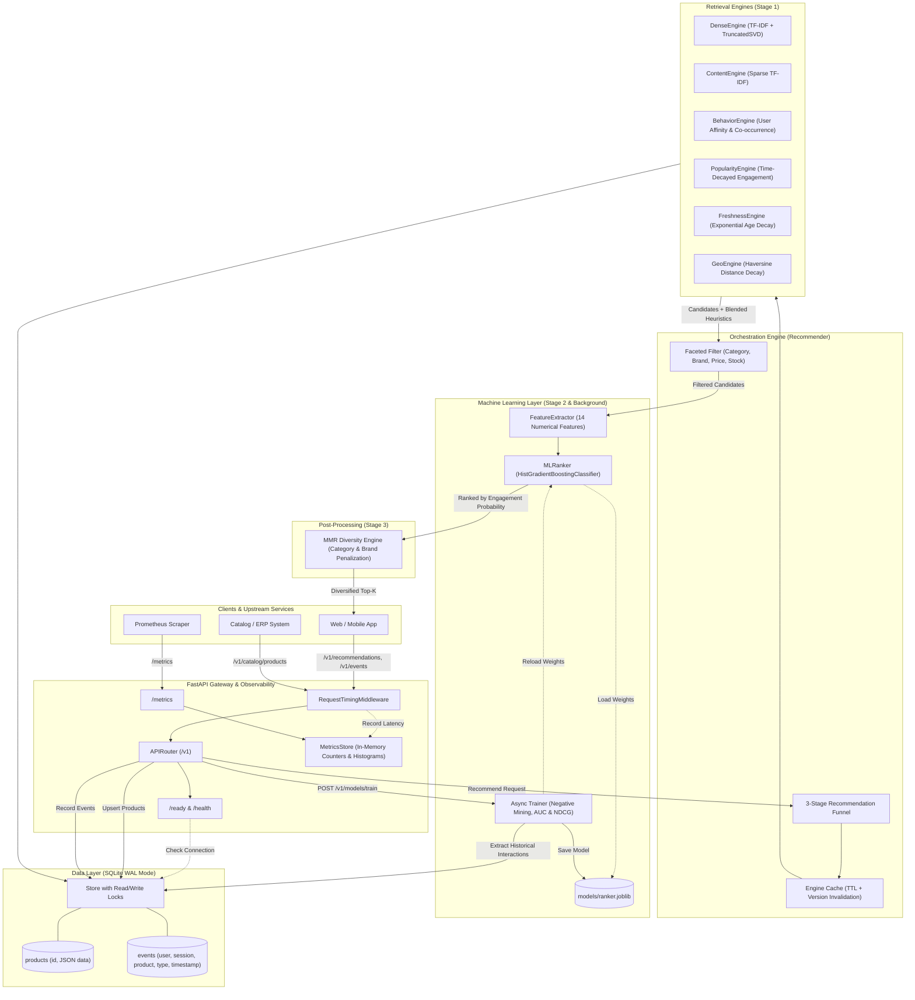
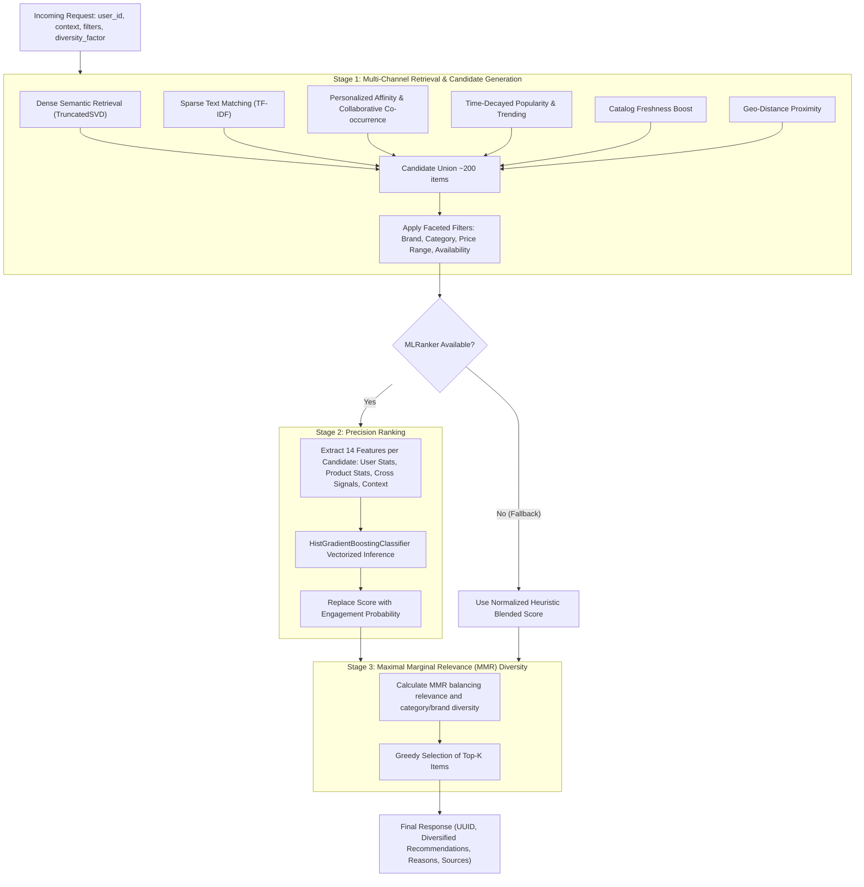
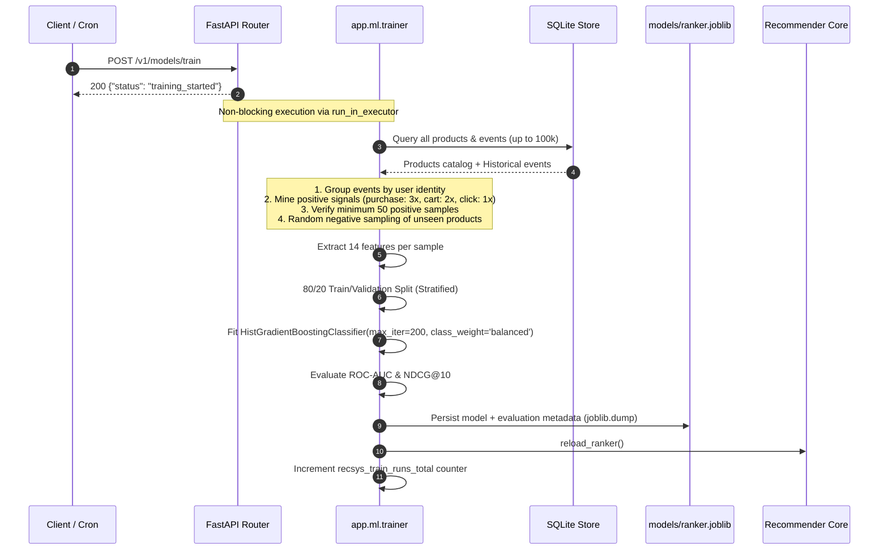

# Recommendation Engine V2 — System Architecture & Data Flow

This document details the multi-stage architecture, data flow, and training pipeline of Recommendation Engine V2.

---

## 1. High-Level System Architecture

---

## 2. 3-Stage Recommendation Funnel (Online Flow)

Every `POST /v1/recommendations` request passes through a 3-stage funnel:

---

## 3. Asynchronous Model Training Pipeline (Offline / Background)

---

## 4. 14 Engineered ML Features

| Index | Feature Name | Description | Group |
|---|---|---|---|
| 0 | `user_click_count` | Total views & clicks recorded for this user | User History |
| 1 | `user_cart_count` | Total add-to-cart actions recorded | User History |
| 2 | `user_purchase_count` | Total purchases completed by user | User History |
| 3 | `user_avg_price_viewed`| Average price of products interacted with | User History |
| 4 | `product_popularity_score`| Time-decayed popularity score | Product Stats |
| 5 | `product_freshness_score` | Exponential decay freshness score (`exp(-age/7)`) | Product Stats |
| 6 | `product_price` | Product catalog price | Product Stats |
| 7 | `product_availability` | 1.0 if in stock, else 0.0 | Product Stats |
| 8 | `category_affinity` | 1.0 if category matches user history | Cross Signals |
| 9 | `brand_affinity` | 1.0 if brand matches user history | Cross Signals |
| 10 | `dense_cosine_sim` | Semantic LSA cosine similarity with context | Cross Signals |
| 11 | `price_ratio` | Ratio of user's average viewed price to product price | Cross Signals |
| 12 | `is_product_context` | 1.0 if context is `product`, else 0.0 | Context |
| 13 | `is_search_context` | 1.0 if context is `search` or query provided | Context |
